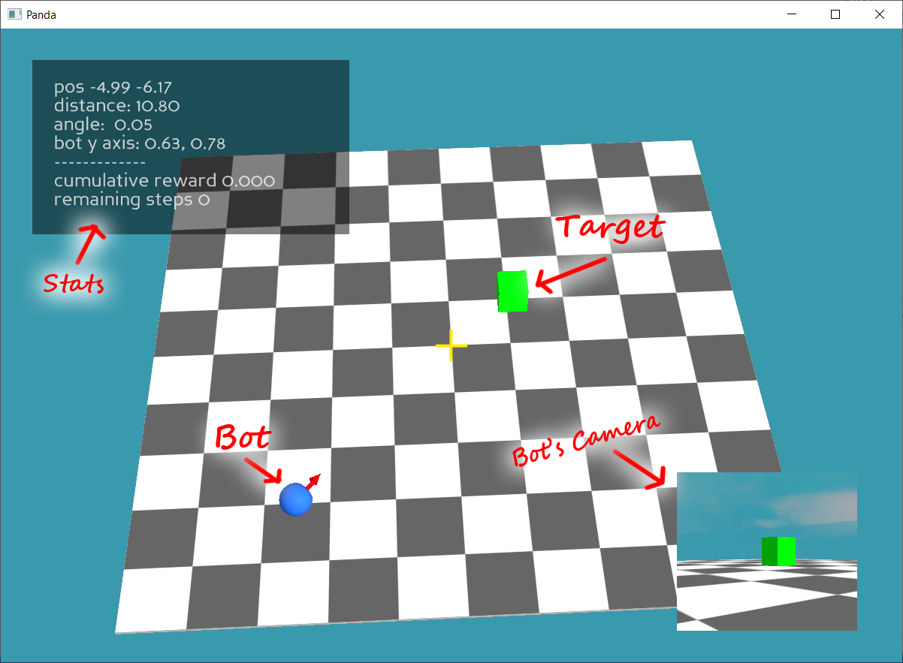

# Problem


In a 3D world the Bot (blue sphere) must reach the target (green cube). The Bot and Target are placed on a square plan with xy coordinates ranging from (-10, -10) to (+10, +10)

<br/>



<br/>

# Solution

The problem is modeled as a Reinforcement Learning algorithm where:

**Observation space**: a (60, 80, 3) RGB image representing the contents captures by a secondary camera attached to the bot.

[environment.py](..\environment.py)
```
self.observation_space = gym.spaces.Box(
    low=0, high=255, shape=(60, 80, 3), 
    dtype=np.uint8)
```

**Action space**: the bot can take 3 discrete actions: move FORWARD (of 1 unit), rotate LEFT (10 degrees) or RIGHT.

[environment.py](..\environment.py)
```
ACTION_FORWARD = 0
ACTION_TURN_LEFT = 1
ACTION_TURN_RIGHT = 2

...

self.action_space = gym.spaces.Discrete(3)
```

**Agent**: A PPO Agent with a CNN policy.

**Reward**: The reward given to the Bot agent after each action corresponds to the decrease (positive reward) or increase (negative reward) of the distance of the Bot to the Target. An additional small negative value (-0.1) is computed for each step to prioritize shorter solutions.


<br/>

# User Interface

```

Middle-mouse-click and drag: rotate the main camera around the world's origin
Mouse-wheel: zoom in/out the main camera

Left-click: Place the Bot on the plane
Shift-left-click: Place the Target on the plane

Ctrl-O: Randomly place the Target on the plane
Ctrl-P: Play one episode with the current Bot/Target positions

Ctrl-T: Start training the algorithm, with parameters provided in the config.cfg file. During Training the 3D Viewport is disabled (it doesn't get refreshed and is unresponsive), log messages for the training process are provided on the command prompt shell.

```

<br/>

# Code

<br/>

### python libraries:

[OpenAI Gym](https://www.gymlibrary.dev/): a standard API for reinforcement learning

[Stable Baselines 3](https://stable-baselines3.readthedocs.io/en/master/): a set of reliable implementations of reinforcement learning algorithms in PyTorch. 

[Panda3d](http://www.panda3d.org): An Open Source Framework for 3D rendering and Games

<br/>

### code:
[config.py](..\config.py)

[environment.py](..\environment.py)

